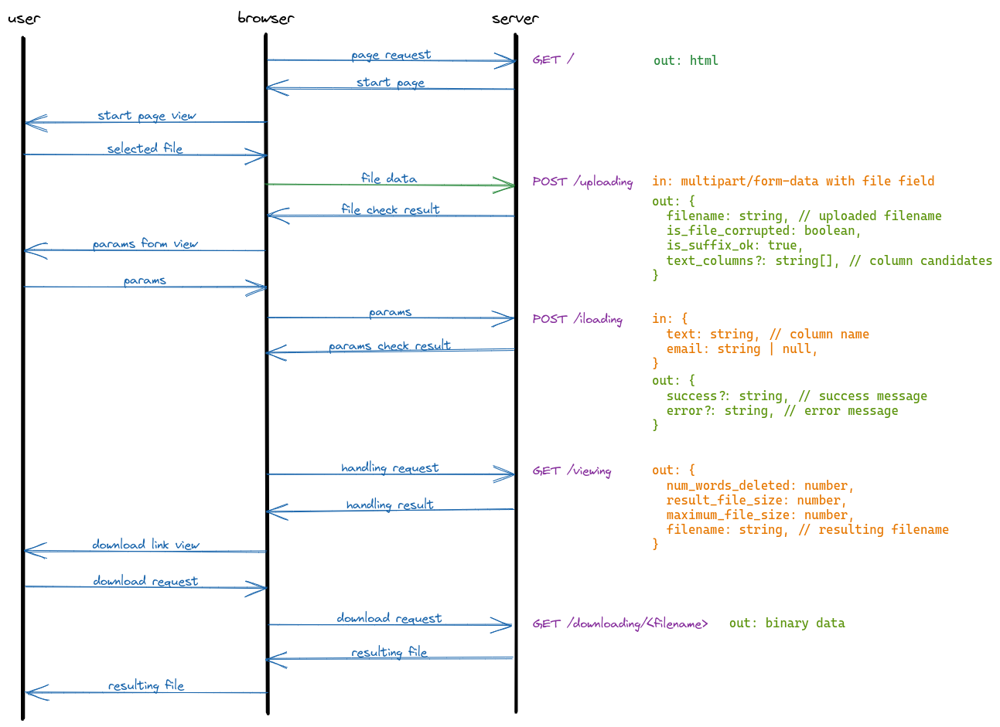

# anonimusui

## Installation

    yarn

## Development

    yarn dev

Application is available at http://localhost:5173. 

It is expected that backend is located at http://localhost:5000. Otherwise appropriate url should be set in VITE_DEV_BACKEND variable of .env.local file. 

## Build

    yarn build

## Data Flow

